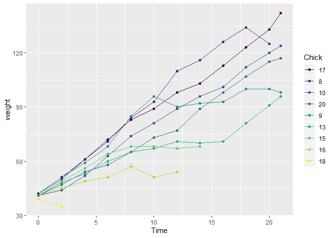
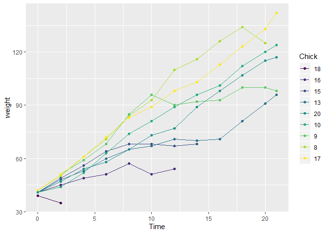
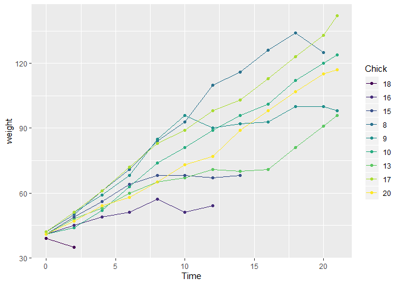

writing function
================
Guangling Xu
2019/10/24

## set up

``` r
library(tidyverse)
```

    ## -- Attaching packages ---------------------------- tidyverse 1.2.1 --

    ## √ ggplot2 3.2.1     √ purrr   0.3.2
    ## √ tibble  2.1.3     √ dplyr   0.8.3
    ## √ tidyr   1.0.0     √ stringr 1.4.0
    ## √ readr   1.3.1     √ forcats 0.4.0

    ## -- Conflicts ------------------------------- tidyverse_conflicts() --
    ## x dplyr::filter() masks stats::filter()
    ## x dplyr::lag()    masks stats::lag()

``` r
library(rvest)
```

    ## Loading required package: xml2

    ## 
    ## Attaching package: 'rvest'

    ## The following object is masked from 'package:purrr':
    ## 
    ##     pluck

    ## The following object is masked from 'package:readr':
    ## 
    ##     guess_encoding

``` r
set.seed(1)
```

## My first function

``` r
x = rnorm(25, mean = 5, sd = 3)

(x - mean(x)) / sd(x) ## z transformation
```

    ##  [1] -0.83687228  0.01576465 -1.05703126  1.50152998  0.16928872
    ##  [6] -1.04107494  0.33550276  0.59957343  0.42849461 -0.49894708
    ## [11]  1.41364561  0.23279252 -0.83138529 -2.50852027  1.00648110
    ## [16] -0.22481531 -0.19456260  0.81587675  0.68682298  0.44756609
    ## [21]  0.78971253  0.64568566 -0.09904161 -2.27133861  0.47485186

### This is a function

``` r
z_score = function(x) {
  
  
  if(!is.numeric(x)){
    stop("x should be numeric")
  }else if(length(x < 3)){
    stop("x should be longer than 3")
    
  }
  z = (x - mean(x)) / sd(x)
  z
  
}
```

## multiple outputs

``` r
mean_and_sd = function(input_x) {
  
  if (!is.numeric(input_x)) {
    stop("Argument x should be numeric")
  } else if (length(input_x) == 1) {
    stop("Cannot be computed for length 1 vectors")
  }
  
  mean_input = mean(input_x)
  sd_input = sd(input_x)

  list(mean = mean_input, 
       sd = sd_input,
       z_score = (input_x - mean(input_x))/ sd(input_x))
}
```

``` r
mean_and_sd = function(x) {
  
  if (!is.numeric(x)) {
    stop("Argument x should be numeric")
  } else if (length(x) == 1) {
    stop("Cannot be computed for length 1 vectors")
  }
  
  mean_x = mean(x)
  sd_x = sd(x)

  tibble(
    mean = mean_x, 
    sd = sd_x
  )
}
```

## multiple inputs

``` r
sim_regression = function(n , beta0 , beta1){
## beta0, beta1 is the population parameter

sim_data = tibble(
  x = rnorm(n, mean = 1, sd = 1),## the sample data we chose from the population
  y = beta0 + beta1 * x + rnorm(n, 0, 1)
)

 ls_fit = lm(y ~ x, data = sim_data)
  
 
 tibble(
 beta0_hat = coef(ls_fit)[1],## intercept first coefficient
 beta1_hat = coef(ls_fit)[2]## slope coefficient
 )
}

sim_regression(n = 1000, beta0 = 17, beta1 = -3)
```

    ## # A tibble: 1 x 2
    ##   beta0_hat beta1_hat
    ##       <dbl>     <dbl>
    ## 1      17.0     -2.99

``` r
url = "https://www.amazon.com/product-reviews/B00005JNBQ/ref=cm_cr_arp_d_viewopt_rvwer?ie=UTF8&reviewerType=avp_only_reviews&sortBy=recent&pageNumber=1"

dynamite_html = read_html(url)

review_titles = dynamite_html %>%
  html_nodes("#cm_cr-review_list .review-title") %>%
  html_text()

review_stars = dynamite_html %>%
  html_nodes("#cm_cr-review_list .review-rating") %>%
  html_text()

review_text = dynamite_html %>%
    html_nodes(".review-data:nth-child(4)") %>%
    html_text()

reviews = tibble(
  title = review_titles,
  stars = review_stars,
  text = review_text
)
```

``` r
read_page_reviews <- function(url) {
  
  h = read_html(url)
  
  review_titles = h %>%
    html_nodes("#cm_cr-review_list .review-title") %>%
    html_text()
  
  review_stars = h %>%
    html_nodes("#cm_cr-review_list .review-rating") %>%
    html_text() %>%
    str_extract("\\d") %>%
    as.numeric()
  
  review_text = h %>%
    html_nodes(".review-data:nth-child(4)") %>%
    html_text()
  
  tibble(
    title = review_titles,
    stars = review_stars,
    text = review_text
  )
}
```

``` r
chks <- subset(ChickWeight, as.integer(Chick) < 10)
chks <- transform(chks, Chick = fct_shuffle(Chick))

ggplot(chks, aes(Time, weight, colour = fct_reorder2(Chick, Time, weight))) +
  geom_point() +
  geom_line() +
  labs(colour = "Chick")
```

<!-- -->

``` r
ggplot(chks, aes(Time, weight, colour = fct_reorder(Chick, weight))) +
  geom_point() +
  geom_line() +
  labs(colour = "Chick")
```

<!-- -->

``` r
ggplot(chks, aes(Time, weight, colour = fct_reorder(Chick, Time))) +
  geom_point() +
  geom_line() +
  labs(colour = "Chick")
```

<!-- -->

## for loop and map

## This is gonna be so great

``` r
l = list(vec_numeric = 5:8,
         mat         = matrix(1:8, 2, 4),
         vec_logical = c(TRUE, FALSE),
         summary     = summary(rnorm(1000)))
l
```

    ## $vec_numeric
    ## [1] 5 6 7 8
    ## 
    ## $mat
    ##      [,1] [,2] [,3] [,4]
    ## [1,]    1    3    5    7
    ## [2,]    2    4    6    8
    ## 
    ## $vec_logical
    ## [1]  TRUE FALSE
    ## 
    ## $summary
    ##     Min.  1st Qu.   Median     Mean  3rd Qu.     Max. 
    ## -3.03684 -0.58307  0.06336  0.06360  0.70050  3.02360

``` r
l$vec_numeric
```

    ## [1] 5 6 7 8

``` r
l$summary
```

    ##     Min.  1st Qu.   Median     Mean  3rd Qu.     Max. 
    ## -3.03684 -0.58307  0.06336  0.06360  0.70050  3.02360

``` r
l[[2]]
```

    ##      [,1] [,2] [,3] [,4]
    ## [1,]    1    3    5    7
    ## [2,]    2    4    6    8

``` r
mean(l$vec_numeric)
```

    ## [1] 6.5

``` r
df = list(
  a = rnorm(20, 3, 1),
  b = rnorm(20, 0, 5),
  c = rnorm(20, 10, .2),
  d = rnorm(20, -3, 1)
)
df$a
```

    ##  [1] 2.746671 1.242546 3.202552 3.707472 3.451493 3.470213 3.521265
    ##  [8] 3.984016 3.592799 1.635268 2.360274 2.940850 4.130710 2.697826
    ## [15] 3.071589 3.161566 2.293546 3.834411 3.543840 3.436414

``` r
df[[2]]
```

    ##  [1]  1.4969330 -6.7611422 -7.2875025 -0.2149273  2.8788235  4.3030510
    ##  [7] -1.8192868  2.4183886 -3.5927162 -5.5752822 -8.4188413  8.6394516
    ## [13] -0.5988329  7.6652761  1.3421204 -6.6272981  1.6516542  3.8904055
    ## [19]  3.2129038  7.9312769

``` r
mean_and_sd = function(x) {
  
  if (!is.numeric(x)) {
    stop("Argument x should be numeric")
  } else if (length(x) == 1) {
    stop("Cannot be computed for length 1 vectors")
  }
  
  mean_x = mean(x)
  sd_x = sd(x)
  tibble(
    mean = mean_x, 
    sd = sd_x
  )
}
```

``` r
mean_and_sd(df[[1]])
```

    ## # A tibble: 1 x 2
    ##    mean    sd
    ##   <dbl> <dbl>
    ## 1  3.10 0.756

``` r
mean_and_sd(df[[2]])
```

    ## # A tibble: 1 x 2
    ##    mean    sd
    ##   <dbl> <dbl>
    ## 1 0.227  5.24

``` r
mean_and_sd(df[[3]])
```

    ## # A tibble: 1 x 2
    ##    mean    sd
    ##   <dbl> <dbl>
    ## 1  9.96 0.157

``` r
mean_and_sd(df[[4]])
```

    ## # A tibble: 1 x 2
    ##    mean    sd
    ##   <dbl> <dbl>
    ## 1 -3.11  1.01

``` r
output = vector("list", length = 4)
```

Write our first for loop\!

``` r
for (i in 1:4) {
  
  output[[i]] = mean_and_sd(df[[i]])
  
}
output
```

    ## [[1]]
    ## # A tibble: 1 x 2
    ##    mean    sd
    ##   <dbl> <dbl>
    ## 1  3.10 0.756
    ## 
    ## [[2]]
    ## # A tibble: 1 x 2
    ##    mean    sd
    ##   <dbl> <dbl>
    ## 1 0.227  5.24
    ## 
    ## [[3]]
    ## # A tibble: 1 x 2
    ##    mean    sd
    ##   <dbl> <dbl>
    ## 1  9.96 0.157
    ## 
    ## [[4]]
    ## # A tibble: 1 x 2
    ##    mean    sd
    ##   <dbl> <dbl>
    ## 1 -3.11  1.01

``` r
output = map(df, mean_and_sd)
output_median = map(df, median)
output_summary = map(df, summary)
output_median = map_dbl(df, median)
output = map_dfr(df, mean_and_sd)
output = map(df, ~mean_and_sd(.x))
```

## Napoleon\!\!

``` r
read_page_reviews = function(url) {
  
  h = read_html(url)
  
  title = h %>%
    html_nodes("#cm_cr-review_list .review-title") %>%
    html_text()
  
  stars = h %>%
    html_nodes("#cm_cr-review_list .review-rating") %>%
    html_text() %>%
    str_extract("\\d") %>%
    as.numeric()
  
  text = h %>%
    html_nodes(".review-data:nth-child(5)") %>%
    html_text()
  
  data_frame(title, stars, text)
}
```

``` r
url_base = "https://www.amazon.com/product-reviews/B00005JNBQ/ref=cm_cr_arp_d_viewopt_rvwer?ie=UTF8&reviewerType=avp_only_reviews&sortBy=recent&pageNumber="
vec_urls = str_c(url_base, 1:5)
vec_urls
```

    ## [1] "https://www.amazon.com/product-reviews/B00005JNBQ/ref=cm_cr_arp_d_viewopt_rvwer?ie=UTF8&reviewerType=avp_only_reviews&sortBy=recent&pageNumber=1"
    ## [2] "https://www.amazon.com/product-reviews/B00005JNBQ/ref=cm_cr_arp_d_viewopt_rvwer?ie=UTF8&reviewerType=avp_only_reviews&sortBy=recent&pageNumber=2"
    ## [3] "https://www.amazon.com/product-reviews/B00005JNBQ/ref=cm_cr_arp_d_viewopt_rvwer?ie=UTF8&reviewerType=avp_only_reviews&sortBy=recent&pageNumber=3"
    ## [4] "https://www.amazon.com/product-reviews/B00005JNBQ/ref=cm_cr_arp_d_viewopt_rvwer?ie=UTF8&reviewerType=avp_only_reviews&sortBy=recent&pageNumber=4"
    ## [5] "https://www.amazon.com/product-reviews/B00005JNBQ/ref=cm_cr_arp_d_viewopt_rvwer?ie=UTF8&reviewerType=avp_only_reviews&sortBy=recent&pageNumber=5"

``` r
output = vector("list", length = 5)
for (i in 1:5) {
  
  output[[i]] = read_page_reviews(vec_urls[[i]])
  
}
```

    ## Warning: `data_frame()` is deprecated, use `tibble()`.
    ## This warning is displayed once per session.

``` r
output = map(vec_urls, read_page_reviews)
```

## list columns / weather df

``` r
weather = 
  rnoaa::meteo_pull_monitors(
    c("USW00094728", "USC00519397", "USS0023B17S"),
    var = c("PRCP", "TMIN", "TMAX"), 
    date_min = "2016-01-01",
    date_max = "2016-12-31") %>%
  mutate(
    name = recode(id, USW00094728 = "CentralPark_NY", 
                      USC00519397 = "Waikiki_HA",
                      USS0023B17S = "Waterhole_WA"),
    tmin = tmin / 10,
    tmax = tmax / 10) %>%
  select(name, id, everything())
```

    ## Registered S3 method overwritten by 'crul':
    ##   method                 from
    ##   as.character.form_file httr

    ## Registered S3 method overwritten by 'hoardr':
    ##   method           from
    ##   print.cache_info httr

    ## file path:          C:\Users\xu499\AppData\Local\rnoaa\rnoaa\Cache/ghcnd/USW00094728.dly

    ## file last updated:  2019-09-26 10:23:06

    ## file min/max dates: 1869-01-01 / 2019-09-30

    ## file path:          C:\Users\xu499\AppData\Local\rnoaa\rnoaa\Cache/ghcnd/USC00519397.dly

    ## file last updated:  2019-09-26 10:23:20

    ## file min/max dates: 1965-01-01 / 2019-09-30

    ## file path:          C:\Users\xu499\AppData\Local\rnoaa\rnoaa\Cache/ghcnd/USS0023B17S.dly

    ## file last updated:  2019-09-26 10:23:25

    ## file min/max dates: 1999-09-01 / 2019-09-30

nest within station

``` r
weather_nest =
  weather %>% 
  nest(data = date:tmin)
```

is the list column really a list??

``` r
weather_nest %>% pull(name)
```

    ## [1] "CentralPark_NY" "Waikiki_HA"     "Waterhole_WA"

``` r
weather_nest %>% pull(data) 
```

    ## <list_of<
    ##   tbl_df<
    ##     date: date
    ##     prcp: double
    ##     tmax: double
    ##     tmin: double
    ##   >
    ## >[3]>
    ## [[1]]
    ## # A tibble: 366 x 4
    ##    date        prcp  tmax  tmin
    ##    <date>     <dbl> <dbl> <dbl>
    ##  1 2016-01-01     0   5.6   1.1
    ##  2 2016-01-02     0   4.4   0  
    ##  3 2016-01-03     0   7.2   1.7
    ##  4 2016-01-04     0   2.2  -9.9
    ##  5 2016-01-05     0  -1.6 -11.6
    ##  6 2016-01-06     0   5    -3.8
    ##  7 2016-01-07     0   7.8  -0.5
    ##  8 2016-01-08     0   7.8  -0.5
    ##  9 2016-01-09     0   8.3   4.4
    ## 10 2016-01-10   457  15     4.4
    ## # ... with 356 more rows
    ## 
    ## [[2]]
    ## # A tibble: 366 x 4
    ##    date        prcp  tmax  tmin
    ##    <date>     <dbl> <dbl> <dbl>
    ##  1 2016-01-01     0  29.4  16.7
    ##  2 2016-01-02     0  28.3  16.7
    ##  3 2016-01-03     0  28.3  16.7
    ##  4 2016-01-04     0  28.3  16.1
    ##  5 2016-01-05     0  27.2  16.7
    ##  6 2016-01-06     0  27.2  20  
    ##  7 2016-01-07    46  27.8  18.3
    ##  8 2016-01-08     3  28.3  17.8
    ##  9 2016-01-09     8  27.8  19.4
    ## 10 2016-01-10     3  28.3  18.3
    ## # ... with 356 more rows
    ## 
    ## [[3]]
    ## # A tibble: 366 x 4
    ##    date        prcp  tmax  tmin
    ##    <date>     <dbl> <dbl> <dbl>
    ##  1 2016-01-01     0   1.7  -5.9
    ##  2 2016-01-02    25  -0.1  -6  
    ##  3 2016-01-03     0  -5   -10  
    ##  4 2016-01-04    25   0.3  -9.8
    ##  5 2016-01-05    25   1.9  -1.8
    ##  6 2016-01-06    25   1.4  -2.6
    ##  7 2016-01-07     0   1.4  -3.9
    ##  8 2016-01-08     0   1.1  -4  
    ##  9 2016-01-09     0   1.4  -4.5
    ## 10 2016-01-10     0   2.3  -3.8
    ## # ... with 356 more rows

``` r
weather_nest$data[[1]]
```

    ## # A tibble: 366 x 4
    ##    date        prcp  tmax  tmin
    ##    <date>     <dbl> <dbl> <dbl>
    ##  1 2016-01-01     0   5.6   1.1
    ##  2 2016-01-02     0   4.4   0  
    ##  3 2016-01-03     0   7.2   1.7
    ##  4 2016-01-04     0   2.2  -9.9
    ##  5 2016-01-05     0  -1.6 -11.6
    ##  6 2016-01-06     0   5    -3.8
    ##  7 2016-01-07     0   7.8  -0.5
    ##  8 2016-01-08     0   7.8  -0.5
    ##  9 2016-01-09     0   8.3   4.4
    ## 10 2016-01-10   457  15     4.4
    ## # ... with 356 more rows

``` r
weather_nest %>% 
  unnest()
```

    ## Warning: `cols` is now required.
    ## Please use `cols = c(data)`

    ## # A tibble: 1,098 x 6
    ##    name           id          date        prcp  tmax  tmin
    ##    <chr>          <chr>       <date>     <dbl> <dbl> <dbl>
    ##  1 CentralPark_NY USW00094728 2016-01-01     0   5.6   1.1
    ##  2 CentralPark_NY USW00094728 2016-01-02     0   4.4   0  
    ##  3 CentralPark_NY USW00094728 2016-01-03     0   7.2   1.7
    ##  4 CentralPark_NY USW00094728 2016-01-04     0   2.2  -9.9
    ##  5 CentralPark_NY USW00094728 2016-01-05     0  -1.6 -11.6
    ##  6 CentralPark_NY USW00094728 2016-01-06     0   5    -3.8
    ##  7 CentralPark_NY USW00094728 2016-01-07     0   7.8  -0.5
    ##  8 CentralPark_NY USW00094728 2016-01-08     0   7.8  -0.5
    ##  9 CentralPark_NY USW00094728 2016-01-09     0   8.3   4.4
    ## 10 CentralPark_NY USW00094728 2016-01-10   457  15     4.4
    ## # ... with 1,088 more rows

## Operations on list columns

can I do useful things with a list column…?

``` r
central_park_df = weather_nest$data[[1]]
lm(tmax ~ tmin, data = central_park_df)
```

    ## 
    ## Call:
    ## lm(formula = tmax ~ tmin, data = central_park_df)
    ## 
    ## Coefficients:
    ## (Intercept)         tmin  
    ##       7.779        1.045

``` r
lm(tmax ~ tmin, data = weather_nest$data[[1]])
```

    ## 
    ## Call:
    ## lm(formula = tmax ~ tmin, data = weather_nest$data[[1]])
    ## 
    ## Coefficients:
    ## (Intercept)         tmin  
    ##       7.779        1.045

``` r
lm(tmax ~ tmin, data = weather_nest$data[[2]])
```

    ## 
    ## Call:
    ## lm(formula = tmax ~ tmin, data = weather_nest$data[[2]])
    ## 
    ## Coefficients:
    ## (Intercept)         tmin  
    ##      22.489        0.326

``` r
lm(tmax ~ tmin, data = weather_nest$data[[3]])
```

    ## 
    ## Call:
    ## lm(formula = tmax ~ tmin, data = weather_nest$data[[3]])
    ## 
    ## Coefficients:
    ## (Intercept)         tmin  
    ##       6.851        1.245

try a loop …

``` r
output = vector("list", length = 3)
for (i in 1:3) {
  
  output[[i]] = lm(tmax ~ tmin, weather_nest$data[[i]])
  
}
```

``` r
weather_lm = function(df) {
  
  lm(tmax ~ tmin, data = df)
  
}
```

``` r
for (i in 1:3) {
  
  output[[i]] = weather_lm(weather_nest$data[[i]])
  
}
output = map(weather_nest$data, weather_lm)
```

``` r
weather_nest %>% 
  mutate(lin_models = map(data, weather_lm)) %>% 
  select(-data) %>% 
  filter(name != "CentralPark_NY")
```

    ## # A tibble: 2 x 3
    ##   name         id          lin_models
    ##   <chr>        <chr>       <list>    
    ## 1 Waikiki_HA   USC00519397 <lm>      
    ## 2 Waterhole_WA USS0023B17S <lm>

## Revisit napoleon … again

``` r
napoleon = 
  tibble(
    page = 1:5,
    urls = str_c(url_base, page)
  ) %>% 
  mutate(
    reviews = map(urls, read_page_reviews)
  ) %>% 
  unnest(reviews) %>% 
  select(-urls)
```
